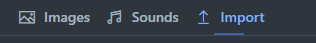
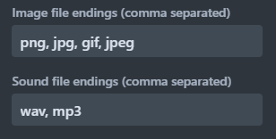
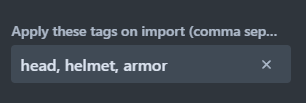
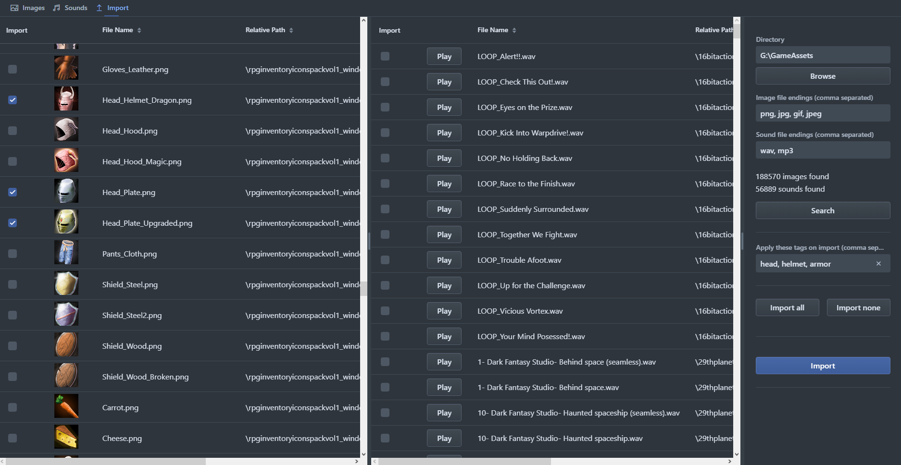
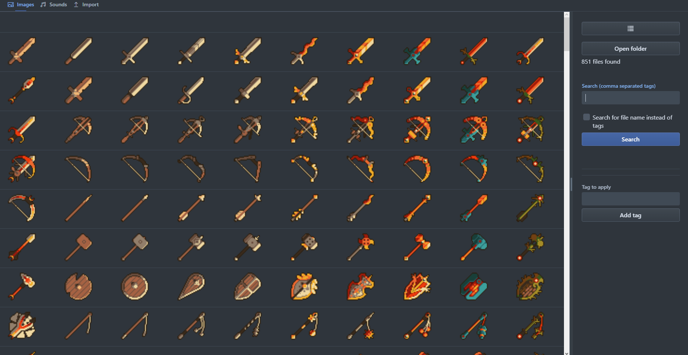
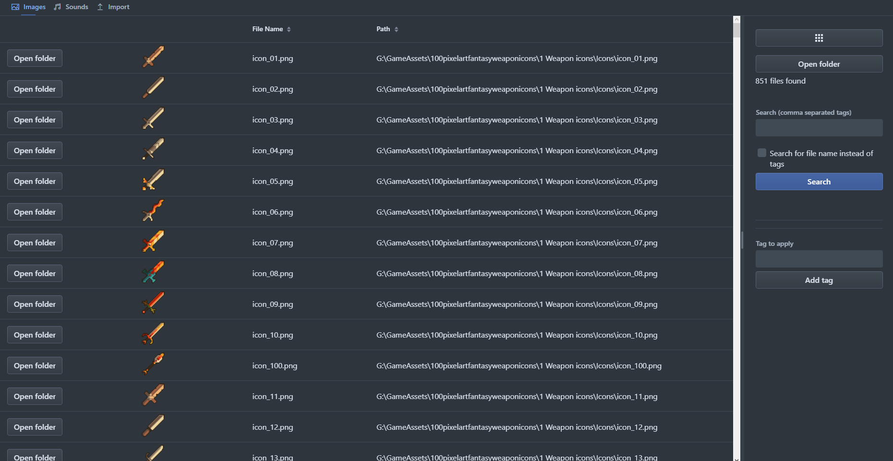
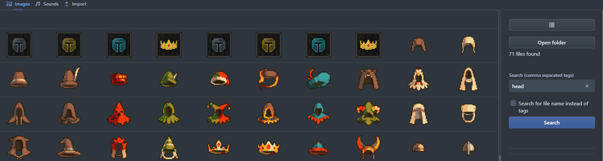
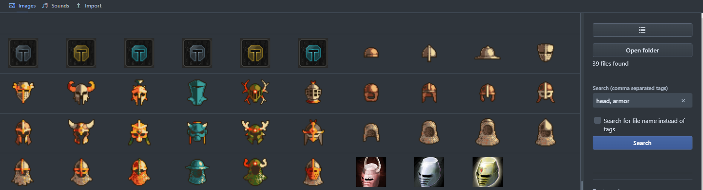
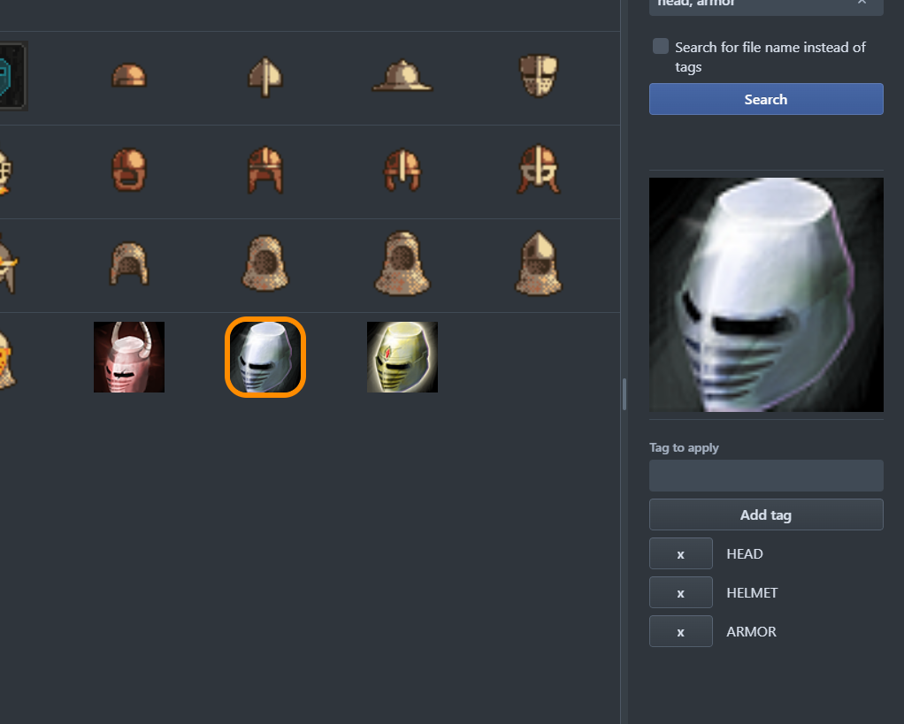
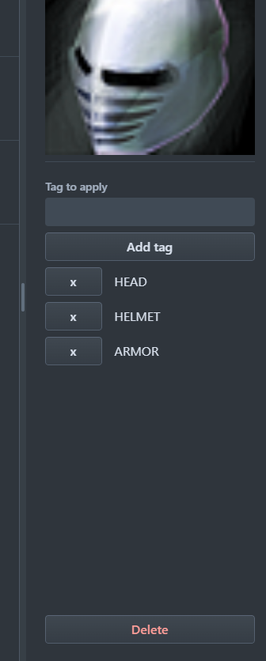

# BtAssetManager

This application allows you to easily categorize large amounts of image and sound files.

You can apply tags to each individual file to search for them based on your own criteria.

The tool has been tested with files of the following format:

- jpg
- png
- gif
- svg
- wav
- mp3

It is intended for sound files and pixel art images. Using large scale textures might lead to poor performance.

## Getting started

Java 17 is required to run this application. You can download Java from different vendors, for example [Adoptium](https://adoptium.net/temurin/releases).

Go to the [release page](https://github.com/Bowtie8904/BtAssetManager/releases) and download the jar file from the latest release.

After the download you can double click the jar file to start the asset manager. It will now create its database structure. Once its started up it will open your default browser and navigate to the
managers website. You should now also see a small blue bowtie in your system tray. Right clicking that icon allows you to open the browser again or to shut down the application.

## Import files

To search for files you first need to import them on the "Import" page. Use the navigation bar at the top to select the "Import" tab.

On the right side of the import page you see a bunch of text fields and buttons.

- **Directory**
    - This is where you specifiy which folder the manager should search for files in. It can be any folder on your computer and you can still import files from other folders later on, so there is no
      need to put everything in one place
    - Either type in your folders name or use the browse button to select it from the list
- **Image and sound file endings**
    - Here you specify which file endings you want to import for both images and sounds
    - You can use commas to separate multiple endings
    - The manager will only look for files that have file endings in one of your text boxes

  
- **Search**
    - Once you have put in a directory to search in and file endings to search for you can press the "Search" button
    - The manager will now go through the directory and all its sub-directories and add the found files to the two lists on the left
- **Apply tags on import**
    - You can already tag files when you import them
    - Add all the tags that you want to apply to the selected files in this field
    - You can add multiple tags by separating them with a comma
    - The manager will suggest similar tags that you already used before

  
- **Import all and import none**
    - These buttons will either select all found files for import or deselect them all
- **Import**
    - This is the button that this page is all about
    - Pressing this button will import all selected files from the two lists on the left
    - Imported files will disappear from the lists and wont return if you press search again
    - After importing you can find the files depending on their type either on the "Images" or the "Sounds" page
    - If you specified tags before the import then those will be applied to the files
    - If you did not specify any tags then these files will have the tag "UNTAGGED" so that you can find them easily

After the import your files are NOT moved. The manager does only save the path to those files. This also means that if you move the files to a different location later on the manager wont be able to
display them anymore.

## Search for files

Searching for images and sounds functions the same, so I will only show screenshots of the image search.

Once you have imported your files you can go over to the "Images" or "Sounds" tabs to search for specific tags.

If you just want to look at all your files then click the search button once.

The first button at the top right lets you switch between a grid and a list view. The list view gives you a bit more information about the filename and path while the grid view allows to display more
images at once.

To search for files you can type tags into the search text field. You can specifiy multiple tags by separating them with a comma. For an image to be found it needs to have all tags in the search field
applied to it. It can have additional ones though that are not in the search field.

If I want to find all my images of head gear then I can search for the tag "head".

But if I would rather find headgear that is more of the armor kind then I can type in "head, armor".

If you want to search for filenames instead of tags then you can check the little box below the search field. The manager will now search for imported files with names that contain the text from the
search field. You can NOT specifiy multiple values with commas. Searching for "helmet" will for example find files like armor_helmet_01.png.

Clicking on an image will show a large version of it on the right side. You can now also click on the "Open folder" button to open the folder that the file in contained in.

At the bottom you can apply single tags to the file or remove existing ones by pressing the "X" button. If you remove all tags from a file it will receive the "UNTAGGED" tag automatically.

If you scroll to the very bottom on the right side you find a delete button. This allows you to remove single files from the manager. You can reimport them on the "Import" page.

